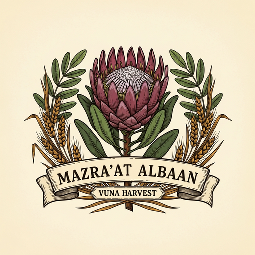

# Mazra'at albaan

**A Solana-based agricultural marketplace for South African smallholder farmers.**
*Internal codename: **Vuna** (the Solana program crate, the technical shorthand).*

Mazra'at albaan gives small farmers seeds, fertilizer, and drought insurance on credit — bundled into one *Grow Pack* and repaid at harvest. When bad weather hits, the parametric policy pays out automatically. The farmer never sees a wallet, a stablecoin, or the word "blockchain".

Built for the **Solana 2026 Frontier Hackathon — Physical World Applications track**.

**Author:** Tumo Mogame

---

## Live demo

| Surface | URL |
|-|-|
| Frontend (Vercel) | https://solana-based-agricultural-marketpla.vercel.app/ |
| Drought-payout (real on-chain data) | https://solana-based-agricultural-marketpla.vercel.app/insurance/AShtE5mNczJqoLYSQzASMHb5vLiAb3RSavPoLW4NyzAd |
| Solana program (devnet) | `7LUkUHVazSw732334JKFP88VAFc4iYXXJZkgFnZV9kqA` |
| Demo Grow Pack PDA | `AShtE5mNczJqoLYSQzASMHb5vLiAb3RSavPoLW4NyzAd` |

The demo pack is in `InsurancePaid` status with **R 1 400** paid out at 40% rainfall (tier 3). Every number on the dashboard, the marketplace, and the insurance view comes from a real on-chain read — no mock data anywhere.

## Two surfaces, one codebase

| Route | Audience | Auth + Wallet |
|-|-|-|
| `/dashboard` | Farmer (mobile-first) | Supabase email login → Privy email-OTP custodial wallet (no seed phrase, no chain words) |
| `/coop` | Cooperative officer / insurance admin | Phantom / Solflare via wallet-adapter — they sign approvals, disbursements, and drought-payout triggers |

The two-tier auth is deliberate: farmers should never see a private key; the co-op staff should, because they're operating the program. Same code, different doors.

## Quick links

- [Formal proposal (PDF)](docs/proposal.pdf) — problems, solution, tech, risks, roadmap (12 pages)
- [Architecture](docs/architecture.md) — on-chain / off-chain split, data flow
- [Regulatory analysis](docs/regulatory.md) — NCA / FAIS / FSCA / SARB / POPIA red lines
- [Insurer outreach pack](docs/outreach/) — one-pager + product-brief PDFs for licensed agri-insurers
- [Mobile mockup](design/mockups/mobile.png) · [Web mockup](design/mockups/web.png) · [Brand mark](design/logo-mark-512.png)
- [`CLAUDE.md`](CLAUDE.md) — internal project briefing (auto-loaded by Claude in this repo)

## Project layout

```
core/        shared TypeScript business logic — credit score, pricing, parametric, repayment
tests/       99 Vitest tests covering core/ rules
programs/    Solana / Anchor program (Rust) — 5 source modules, 6 instructions, 41 cargo tests
app/         Next.js frontend — Mazra'at albaan branded, deployed to Vercel
docs/        narrative + reference docs (PDFs + markdown)
design/      UI mockups + brand palette + logo SVGs
scripts/     Python build scripts (PDF + mockup + logo + banner builders)
spikes/      throwaway research code (Pyth/Switchboard probes)
api/         Node.js backend (scaffold — not started yet)
```

Each folder has a `CLAUDE.md` with sub-context.

## Run it locally

### Frontend

```bash
cd app
pnpm install
pnpm dev                 # http://localhost:3000
pnpm test                # 40 unit tests (PDA, pricing, encoders for 5 instructions)
pnpm build               # Next.js production build
pnpm exec tsc --noEmit   # typecheck
```

No Supabase / Privy / ElevenLabs project? You don't need any of them for the basic demo — every external integration falls back to a sane default when its env var is missing:

| Missing env var | What you lose |
|-|-|
| `NEXT_PUBLIC_SUPABASE_URL` (+ key) | Real auth — `/login` falls into a stub-user demo mode |
| `NEXT_PUBLIC_PRIVY_APP_ID` | Custodial farmer wallet — falls back to wallet-adapter / Phantom |
| `ELEVENLABS_API_KEY` | Listen-aloud + voice tour — `/api/tts` returns 503 |

### Solana program

```bash
cd programs/vuna/programs/vuna
cargo test --lib         # 41 host-side unit tests
cargo test --test lifecycle  # 3 litesvm integration tests
cargo build-sbf          # produces target/deploy/vuna.so
```

### Core TypeScript spec

```bash
# from repo root
npm install
npm test                 # 99 Vitest tests
```

## Test coverage at a glance

- **99** Vitest tests in `tests/` — `core/` rules
- **41** cargo unit tests + **3** litesvm integration tests in `programs/vuna/programs/vuna/` — Rust port + on-chain lifecycle
- **40** Vitest tests in `app/src/lib/vuna/program.test.ts` — PDA derivation, pricing math, instruction-encoder byte layouts for 5 on-chain instructions
- **Total: 183 tests across 3 languages, all passing**

## Why this exists

Smallholders grow ~70% of African food but receive under 5% of bank lending. One bad rainy season and a family sells a cow to eat. This is one honest attempt to close that gap.

It's development infrastructure, not a Series A pitch. Read `docs/proposal.pdf` §7 (Disadvantages) and §8 (Challenges) before getting excited about anything. Most of what's hard about this problem is off-chain — trust, fraud, default recovery, ground-truth verification — and the smart contract doesn't fix any of those.
