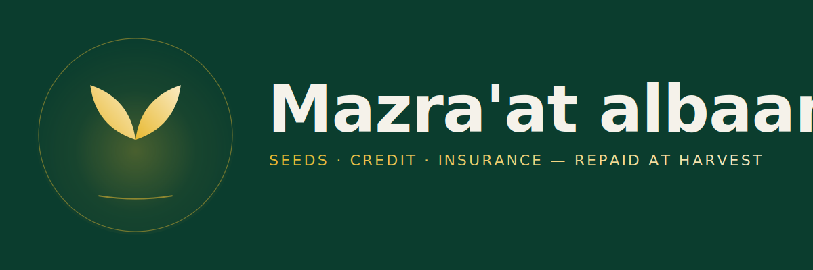

# app/

Next.js frontend for **Mazra'at albaan** — two surfaces, one codebase: a farmer mobile-first dashboard at `/dashboard` and a cooperative-officer admin panel at `/coop`. Internal codename: **Vuna**.

## Live deployment

| | |
|-|-|
| Frontend | https://solana-based-agricultural-marketpla.vercel.app/ |
| Drought-payout demo (real on-chain data) | https://solana-based-agricultural-marketpla.vercel.app/insurance/AShtE5mNczJqoLYSQzASMHb5vLiAb3RSavPoLW4NyzAd |
| Solana program | `7LUkUHVazSw732334JKFP88VAFc4iYXXJZkgFnZV9kqA` (devnet) |

## Status

Originally lifted from a separate Next.js + Supabase project on 2026-05-07, then heavily restructured for Vuna. As of **2026-05-10** it's:

- Fully rebranded to Mazra'at albaan with the designed logo SVG/PNG mark in `public/brand/`
- Stripped of all Social-Assembly-specific code
- Wired to the deployed Solana program via hand-rolled Borsh decoders
- **Custodial farmer wallet via Privy** (email-OTP → embedded Solana wallet, no seed phrase) — env-var gated; falls back to wallet-adapter when not configured
- **Wallet-adapter (Phantom + Solflare)** kept for the co-op surface (`/coop`) — staff sign approvals / disbursements / drought-payout triggers themselves
- **ElevenLabs voice** — read-aloud buttons + a guided dashboard tour (`/api/tts` proxies the API key server-side)
- All dashboard data is live on-chain — no mock pack/alerts; honest empty states when nothing is registered yet
- Deployed to Vercel with auto-deploy on push to `main`

See [`CLAUDE.md`](CLAUDE.md) for full context.

## Quick start

```bash
cd app
pnpm install
cp .env.example .env.local      # optional — see Env vars below
pnpm dev                         # http://localhost:3000
```

```bash
pnpm test                        # 40 Vitest tests (PDA, pricing, ix encoders for 5 instructions)
pnpm exec tsc --noEmit           # typecheck
pnpm build                       # production build (matches Vercel)
pnpm lint                        # next lint
```

No env vars at all? You'll get demo-mode auth, wallet-adapter (Phantom popup) instead of Privy, and a 503 on the voice button — the dashboard still loads and the on-chain reads still work.

## Routes

| Route | Audience | What |
|-|-|-|
| `/` | Public | Mazra'at albaan landing |
| `/login` · `/signup` · `/forgot-password` · `/reset-password` | Public | Supabase auth, with demo-mode bypass when env vars absent |
| `/dashboard` | Farmer | Mobile-first dashboard. Profile header tabs: Active · Apply · Insurance · History · About. Sidebar items: Home · Apply for Pack · Insurance · Wallet · Marketplace · Take a tour. All on-chain reads, no fabricated data. |
| `/grow-pack/new` | Farmer | Standalone Apply form (shareable URL) |
| `/insurance/[packId]` | Public | Server-rendered shareable view of any GrowPack — pulls live from devnet at request time |
| `/coop` | Co-op staff / insurer admin | Approve / Disburse / Trigger drought payout. Phantom-only, scans every GrowPack PDA on the program. |
| `/api/tts` | Server | ElevenLabs proxy (`?warmup=1` for cold-start mitigation) |

## Devnet demo setup

To create a registered farmer + active Grow Pack with a fired drought trigger on devnet:

```bash
node scripts/setup-devnet-demo.mjs
```

Uses your default Solana CLI keypair as the cooperative. Idempotent. The wallet you ran this with becomes the cooperative on the resulting `FarmerAccount` — to drive `/coop` actions you'll need Phantom signed in with the same key.

## Env vars

See [`.env.example`](.env.example). All optional; each missing var triggers a graceful fallback documented next to its row.

| Var | Where | Use | If missing |
|-|-|-|-|
| `NEXT_PUBLIC_SUPABASE_URL` | client | Real Supabase auth | Demo-mode stub user |
| `NEXT_PUBLIC_SUPABASE_ANON_KEY` | client | Real Supabase auth | Demo-mode stub user |
| `SUPABASE_SERVICE_ROLE_KEY` | server | Server-side admin | Server actions degrade |
| `NEXT_PUBLIC_SOLANA_RPC` | client | Override default `https://api.devnet.solana.com` | Default devnet |
| `NEXT_PUBLIC_PRIVY_APP_ID` | client | Custodial farmer wallet (email-OTP → embedded Solana) | Falls back to wallet-adapter / Phantom on `/dashboard` |
| `NEXT_PUBLIC_SOLANA_CLUSTER` | client | Tells Privy + the bridge which cluster to sign for. `mainnet`, `devnet`, or `testnet`. | Defaults to `devnet` |
| `ELEVENLABS_API_KEY` | server | ElevenLabs TTS via `/api/tts` | `<ListenButton />` + voice tour show 503 errors |
| `ELEVENLABS_VOICE_ID` | server | Override the default Sarah voice | Uses default `EXAVITQu4vr4xnSDxMaL` |

## Supabase setup

Run the SQL files in `supabase/migrations/` in numerical order in your Supabase project's SQL Editor:

- `20260507_001_notifications.sql`
- `20260507_002_profiles.sql`
- `20260507_003_posts.sql`

Enable email/password in Auth → Providers (and Google + Apple if you want `social-auth.tsx` to work).

## Privy setup

1. Sign up free at https://privy.io and create an app.
2. Copy the App ID into `NEXT_PUBLIC_PRIVY_APP_ID` in `.env.local`.
3. In the Privy dashboard, under **Login methods**, enable **Email**.
4. Under **Embedded wallets → Solana**, toggle ON; set "Create on login" to **Users without wallets**.
5. Under **Settings → Allowed origins**, add your local + Vercel URLs (e.g. `http://localhost:3000`, `https://solana-based-agricultural-marketpla.vercel.app`).

If steps 3–4 are skipped, `useWallets()` from `@privy-io/react-auth/solana` returns no wallets and the dashboard's wallet button shows the email but transactions can't sign. Toggle them on, then sign out and back in to re-create.

## Vercel deployment

Critical settings:

- **Root Directory:** `app/`
- **Framework Preset:** Next.js (auto-detected after setting Root Directory)
- All other settings can stay default
- Add the same env vars on Vercel — Privy / ElevenLabs / Supabase

## Tests

```bash
pnpm test                 # 40 Vitest tests, all passing
```

Coverage:
- PDA derivation (farmer, pack)
- Grow Pack pricing math (`quoteGrowPack`)
- Instruction encoder byte layouts + account ordering for **5** instructions:
  - `register_farmer`, `request_grow_pack` (farmer surface)
  - `approve_grow_pack`, `disburse_grow_pack`, `trigger_insurance_payout` (co-op surface)

The remaining encoder (`settle_repayment`) is still inlined in `scripts/setup-devnet-demo.mjs`. Lift it when the harvest-close UI lands.

## Mockup references

- Farmer mobile: [`../design/mockups/mobile.png`](../design/mockups/mobile.png)
- Co-op web: [`../design/mockups/web.png`](../design/mockups/web.png)
- Brand mark: [`../design/logo-mark.svg`](../design/logo-mark.svg) · [`../design/logo-horizontal.svg`](../design/logo-horizontal.svg)
